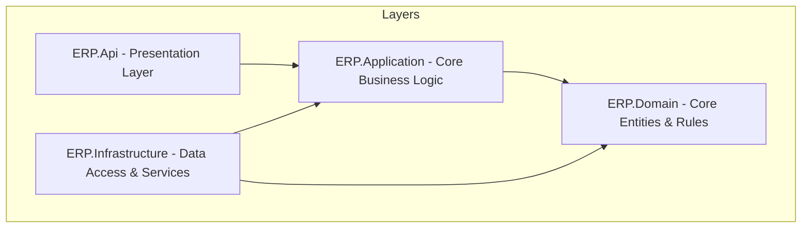

# ERP Enterprise System (Core & General Definitions)

[](https://dotnet.microsoft.com/)
[](https://www.nuget.org/packages/Microsoft.EntityFrameworkCore)
[](https://blog.cleancoder.com/uncle-bob/2012/08/13/the-clean-architecture.html)
[](https://github.com/jbogard/MediatR)

A robust, enterprise-grade Enterprise Resource Planning (ERP) Backend System built using **ASP.NET Core Web API**, following **Clean Architecture** principles and the **CQRS (Command Query Responsibility Segregation)** pattern with **MediatR**. 

This repository implements the core general definitions, data structures, registries, and configuration models required to power a modular ERP platform.

---

## 🏗️ Architecture Overview

The system is designed using **Clean Architecture** to ensure loose coupling, high testability, and clear separation of concerns.



### 📁 Project Structure

*   **`ERP.Domain`**: Contains enterprise core entities, enums, value objects, and interfaces. It has zero external dependencies on frameworks or databases.
*   **`ERP.Application`**: Contains application-specific business rules, DTOs, interfaces, validators, and CQRS handlers (Commands & Queries using MediatR).
*   **`ERP.Infrastructure`**: Implements repositories (generic and specific), EF Core database context (`AppDbContext`), migrations, file storage services, validation pipelines, and dependency injections.
*   **`ERP.Api`**: The entry point of the application (ASP.NET Core Web API). Configures middlewares, dependency containers, routing, Swagger documentation, and exposes controllers.

---

## 🛠️ Tech Stack & Key Libraries

*   **Backend Framework:** .NET 9.0 (Windows)
*   **Database ORM:** Entity Framework Core (EF Core 9.0) with SQL Server
*   **Design Patterns:**
    *   **CQRS:** Segregating read and write operations using **MediatR**
    *   **Repository & Unit of Work:** For decoupled database operations
*   **Data Mapping:** **AutoMapper** & **Mapster**
*   **Validation:** **FluentValidation** (automatic pipeline validations)
*   **API Documentation:** Swagger via **Swashbuckle**
*   **API Versioning:** `Microsoft.AspNetCore.Mvc.Versioning`

---

## 📦 Implemented Modules (General Definitions)

The core database schemas and API controllers are fully structured around crucial organizational configurations:

| Module | Features & Entities |
| :--- | :--- |
| **👥 Client Management** | Client registries, client contacts, customer types, and customized price lists |
| **🤝 Supplier Management** | Suppliers database, supplier contacts, supplier-specific items, and supplier categories |
| **📦 Inventory & Items** | General item registries, items categories, item prices, unit of measurements (UOM) |
| **🏢 Organization & Warehouses** | Corporate departments, stores, storage categorization, and warehouses |
| **📍 Geolocation** | Multi-level geographical structure (Countries ➡️ Regions ➡️ Cities) |
| **📁 Utilities** | Centralized local file upload and storage management service |

---

## 🚀 Getting Started

Follow these steps to run the backend API server locally.

### Prerequisites
*   [.NET 9.0 SDK](https://dotnet.microsoft.com/en-us/download/dotnet/9.0)
*   [MS SQL Server](https://www.microsoft.com/en-us/sql-server/sql-server-downloads) (or LocalDB)
*   An IDE like Visual Studio 2022 or VS Code

### 1. Clone & Configure Connection String
Open `ERP.Api/appsettings.json` and configure the connection string to point to your SQL Server instance:

```json
"ConnectionStrings": {
  "DbConnection": "Server=YOUR_SERVER;Database=ErpWebDemo;Trusted_Connection=True;TrustServerCertificate=True;"
}
```

*Note: Update the `FileStorageSettings.FolderPath` to a valid local directory on your machine to save uploaded attachments.*

### 2. Apply Migrations
Open your terminal in the solution directory and run the following command to create the database and tables:

```bash
dotnet ef database update --project ERP.Infrastructure --startup-project ERP.Api
```

### 3. Run the API
To launch the Web API project, run:

```bash
dotnet run --project ERP.Api
```

Once started, navigate to:
*   **Swagger API Docs:** `https://localhost:<port>/swagger/index.html` (e.g., `https://localhost:7195/swagger`)

---

## 💡 Architecture & CQRS Pattern Details

When a request arrives at an API controller, it is dispatched as a Command (Write) or Query (Read) using `IMediator`:

```
[API Controller] 
       │
       ▼ (Sends Query/Command)
  [MediatR Mediator]
       │
       ▼ (Dispatches to)
  [Request Handler (Application Layer)]
       │
       ├─► [Validation Pipeline (FluentValidation)]
       ├─► [Unit of Work / Repositories (Infrastructure Layer)]
       ▼
  [SQL Server DB]
```

This ensures that the presentation layer never interacts directly with database models or business repositories. All transactions and validations are managed in isolated, testable components.
